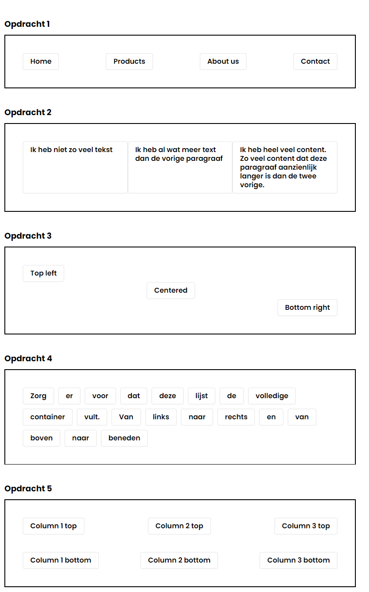
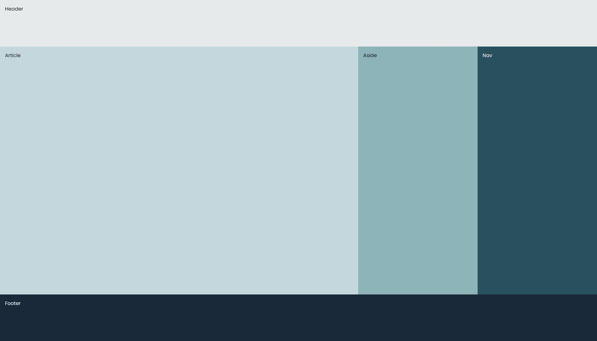
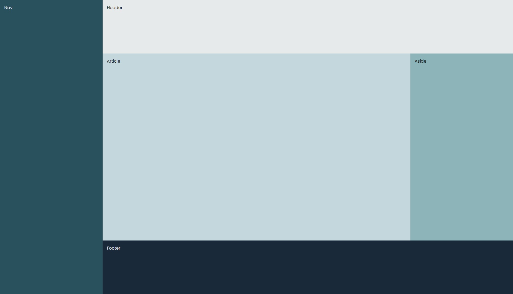
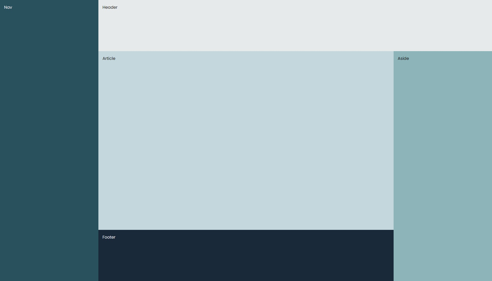
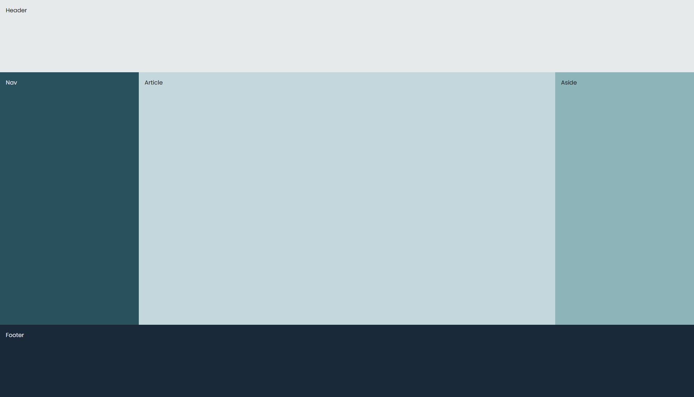
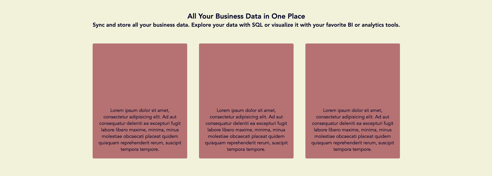
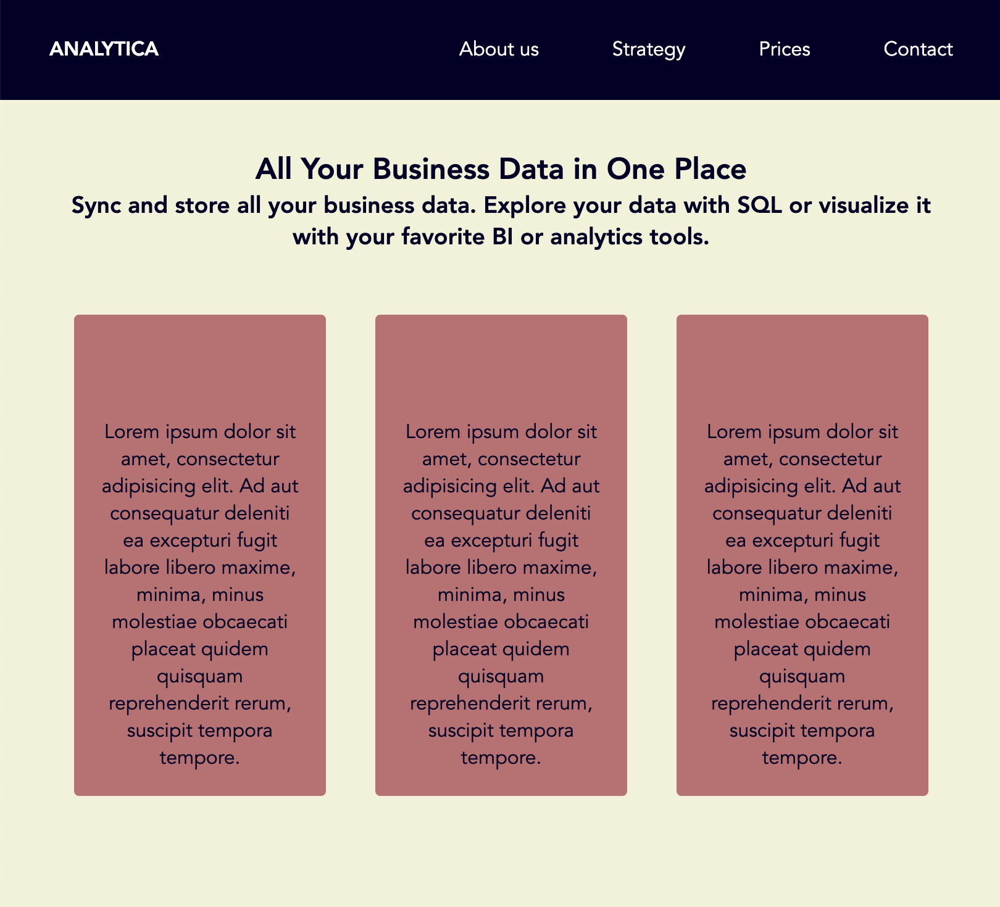

# Opdrachtomschrijving

Zoals je hebt geleerd kun je met flexbox HTML elementen op diverse manier uitlijnen, maar ook complexe layouts maken.
In de eerste opdracht ga je vooral de children (flex items) binnen de parent (flex container) uitlijnen. In het tweede
deel ga je complexere layouts bouwen door gebruik te maken van properties als `flex-basis`, `flex-grow` en `flex-shrink`. In de derde opdracht laten we je los: dan ga je een simpele webpagina maken met flexbox.
.

De HTML elementen (de containers én items) die je moet uitlijnen zijn in de eerste twee opdrachten al voor je klaargezet, zodat jij alleen de CSS
hoeft te schrijven. Benieuwd welke flexbox properties er allemaal zijn? Je vindt hier een overzicht van
alle [Flexbox properties](https://css-tricks.com/snippets/css/a-guide-to-flexbox/) uitgesplitst op properties die van
toepassing zijn op de parent (flex container) en de children (flex items).

## Inhoudsopgave

### Opdracht 1: Positioneren met Flexbox

1. [Eindresultaat](#11-eindresultaat)
2. [Randvoorwaarden](#12-randvoorwaarden)
3. [Stappenplan](#13-stappenplan)

### Opdracht 2: Layouts bouwen met Flexbox

1. [Eindresultaat](#21-eindresultaat)
2. [Randvoorwaarden](#22-randvoorwaarden)
3. [Stappenplan](#23-stappenplan)

### Opdracht 3: Webpagina met flexbox

1. [Eindresultaat](#31-eindresultaat)
2. [Randvoorwaarden](#32-randvoorwaarden)

## Opdracht 1: Positioneren met Flexbox

### 1.1 Eindresultaat

### 1.2 Randvoorwaarden

In het `index.html` bestand hebben we 5 opdrachten uitgewerkt. Zorg ervoor dat deze onderdelen er exact zo uit komen te
zien als in het voorbeeld dat erboven wordt weergegeven. De CSS voeg je toe aan
het [styles.css](deel-1-flexbox-positioneren/styles/styles.css) bestand. Loop je vast bij het maken van de opdracht?
Bekijk dan eens het stappenplan om te zien of dat je verder helpt.

* Je hoeft géén nieuwe HTML elementen te creëren, maar daar waar nodig mag je wel classes toevoegen aan de bestaande
  elementen in het [index.html](deel-1-flexbox-positioneren/index.html) bestand;
* Elke deel-opdracht heeft een eigen `section` element. Dit element is om een nieuwe deel-opdracht aan te duiden en
  gebruik je niet om je elementen op uit te lijnen. Dit doe je dus alleen op de `div`, `ul` of `li` items;
* Je mag de bestanden (`.css` & `.html`) niet verplaatsen;
* Je mag het bestand `do-not-edit` niet aanpassen. Hier zit de basis-opmaak in voor de elementen;
* Je gebruikt enkel flexbox properties om de elementen uit te lijnen, dus geen `position`, `padding` of `margin`!

_TIP_: Kom je er niet helemaal uit? Check of de parent container is voorzien van de benodigde flexbox properties en voeg
telkens 1 nieuwe property toe en kijk of dit je een stap dichter bij het eindresultaat brengt. Voeg daarna pas een
volgende property toe indien nodig.

#### Deelopdracht 1:

#### Deelopdracht 2:

#### Deelopdracht 3:

#### Deelopdracht 4:

#### Deelopdracht 5:

- [ ] Als je goed oplet, zie je dat de items in de eerste kolom links uitgelijnd zijn, de items in de tweede kolom in
  het midden en de items in de rechter kolom rechts. Dit zul je dus voor iedere kolom apart moeten instellen. In de
  kolommen loopt de kruis-as van links naar rechts. Welke property had je ook alweer nodig om items over de kruis-as te
  verplaatsen? Tip: spiek [hier](https://css-tricks.com/snippets/css/a-guide-to-flexbox/#aa-align-items) eens!

## Opdracht 2: Layouts met Flexbox

### 2.1 Eindresultaat

Alle afbeeldingen (maar wel verkleind!)

### 2.2 Randvoorwaarden

In iedere opdracht-map vind je een HTML-pagina met elementen en een (leeg) CSS-bestand. Zorg er met Flexbox voor dat de
elementen zich precies zo positioneren als in het voorbeeld. Controleer hierbij ook altijd goed of de layout niet kapot
gaat wanneer je de tekst eruit haalt, of juist meer tekst toevoegt.

* Je mag niets aanpassen in de `index.html` bestanden, maar daar waar nodig mag je wel classes toevoegen aan de
  bestaande elementen.
* Je mag het bestand `global-styles.css` niet aanpassen. Hier zit de basis-opmaak in voor de layouts, waaronder de
  achtergrond kleuren van de verschillende elementen.
* Je gebruikt enkel flexbox properties om de elementen uit te lijnen, dus geen `position`, `padding` of `margin`!

_TIP_: Kom je er niet helemaal uit? Teken eerst uit welke richtingen je allemaal nodig hebt om alle items naast- en
onder elkaar te krijgen.

_TIP_: Als je `flex-shrink` of `flex-grow` properties wil gebruiken, zul je altijd eerst een `flex-basis`-waarde moeten
declareren. Hoeft het element geen specifieke breedte te hebben, maar vooral alle overgebleven ruimte opvullen? Gebruik
dan `flex-basis: auto` en wijs de juiste shrink- en grow-waardes toe.

### Deelopdracht 1:

- [ ] Controleer of de layout er nog steeds goed uitziet als je bijvoorbeeld 500 worden toevoegt aan het artikel, of
  juist alle tekst verwijderd.

### Deelopdracht 3:

Zoals je kunt zien lijkt de opmaak van deze opdracht veel op de vorige... Om de flex-items in de `main` na, hebben zij
dezelfde de `flex-grow` en `flex-shrink` properties. Alleen de `aside` mag niet groeien of krimpen, maar `article` mag
juist wel groeien en krimpen.

### Deelopdracht 4:

- [ ] Controleer of de layout er nog steeds goed uitziet als je bijvoorbeeld 500 worden toevoegt aan het artikel, of
  juist alle tekst verwijderd.

### Deelopdracht 5:

- [ ] Controleer of de layout er nog steeds goed uitziet als je bijvoorbeeld 500 worden toevoegt aan het artikel, of
  juist alle tekst verwijderd.

## Opdracht 3: Landingspagina

### 3.1 Eindresultaat (deel 1)

#### Breed scherm

#### Smaller scherm

### 3.2 Randvoorwaarden (deel 1)
* De kleuren die gebruikt zijn komen uit [dit palet](https://coolors.co/151e3f-030027-f2f3d9-dc9e82-c16e70). Het lettertype mag je zelf uitkiezen.
* De titels hebben we er alvast ingezet, maar de andere elementen mag je zelf maken. Je gaat nu dus zowel aan de slag in het CSS-bestand, als in het HTML-bestand.
* Zorg dat in ieder rood blok een element is, met daarin een `
`-element van 30 woorden. Deze tekst moet altijd aan de **onderkant** van het blok staan. Deze rode blokken mogen maximaal 280 pixels breed worden en evenredig krimpen als er minder ruimte beschikbaar is. Ze moeten altijd `350px` hoog zijn.
* Zorg dat alle tekst en blokken in het midden van de pagina worden uitgelijnt. Gebruik hier geen `margin: 0 auto` voor, maar maak gebruik van flexbox!
* Let op: je hoeft geen gebruik te maken van media-queries.

### 3.3 Eindresultaat (deel 2)
De landingspagina begint langzaam vorm te krijgen. Je gaat deze pagina nu uitbreiden met een navigatiebalk. Dit doe je uiteraard in hetzelfde bestand. Deze navigatiebalk staat boven de rest van de content en ziet er zo uit:

#### Breed scherm

#### Smaller scherm

### Randvoorwaarden
* De content staat minimaal 40 pixels van de rand van het scherm af, zowel in de navigatiebalk als op de pagina zelf.
* Let op: je hoeft géén gebruik te maken van media-queries.
