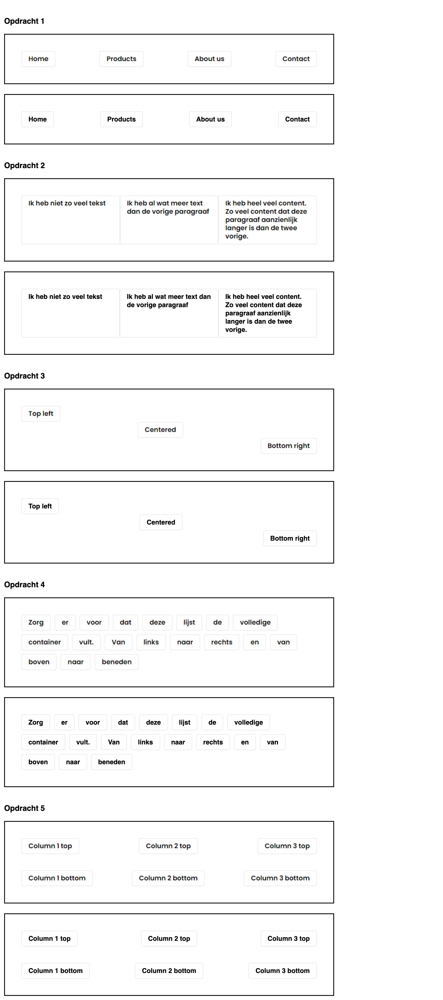
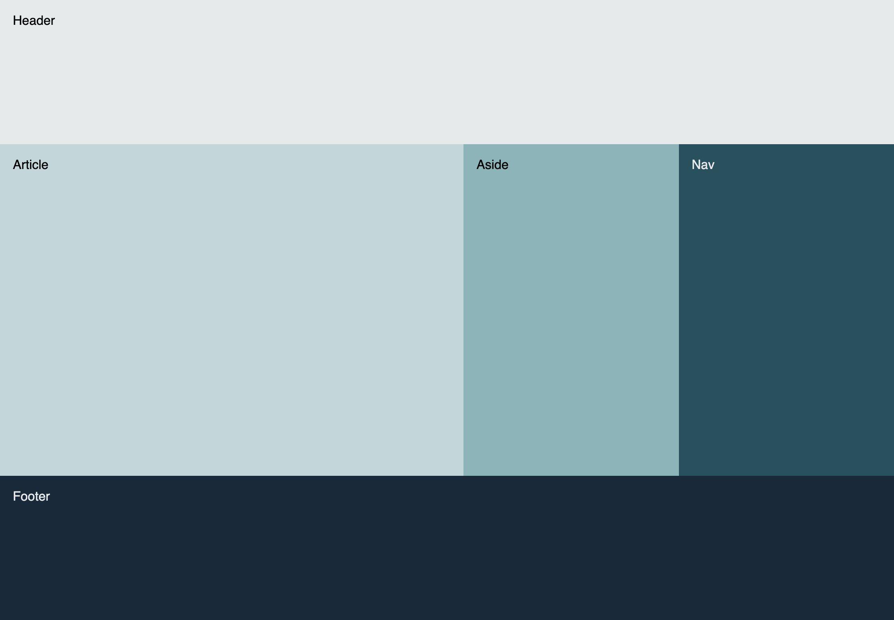
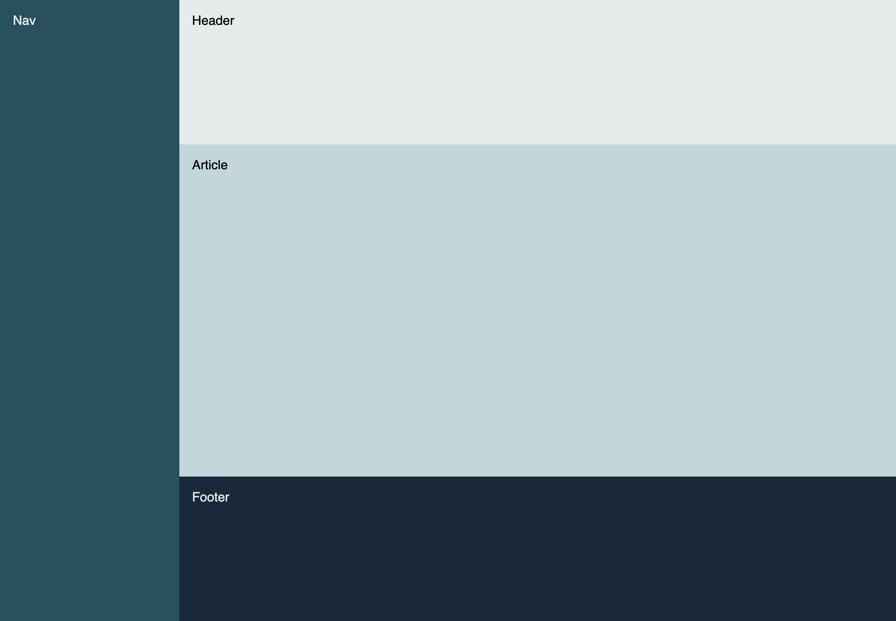
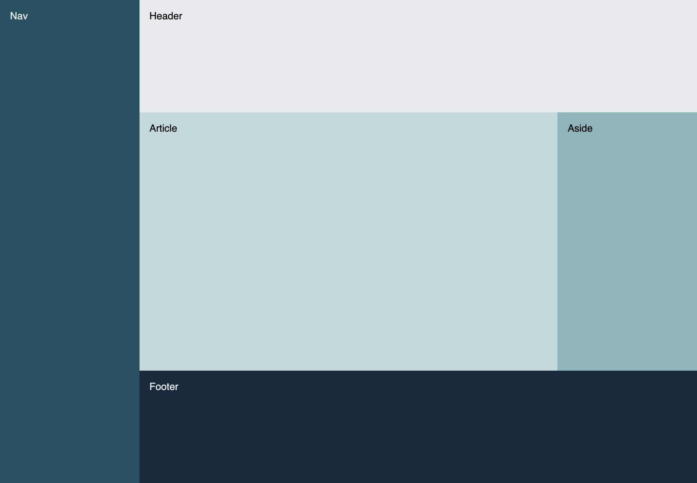
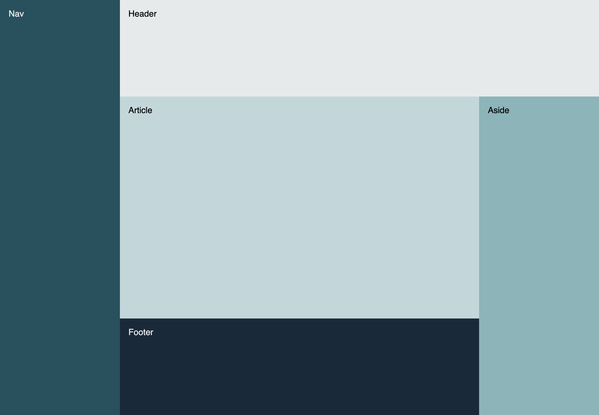
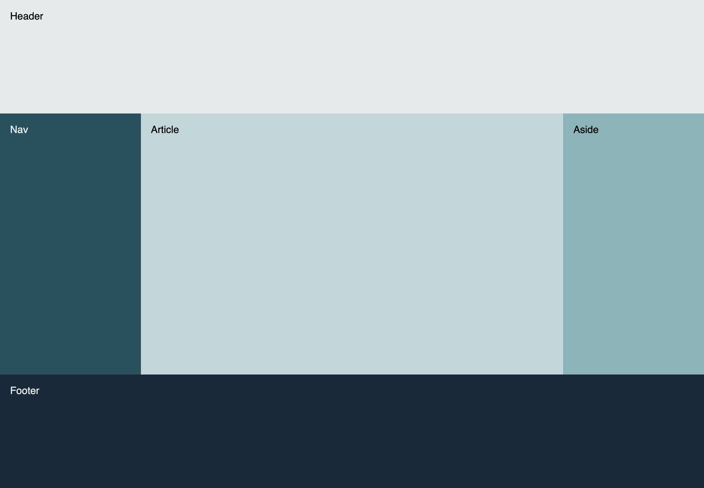
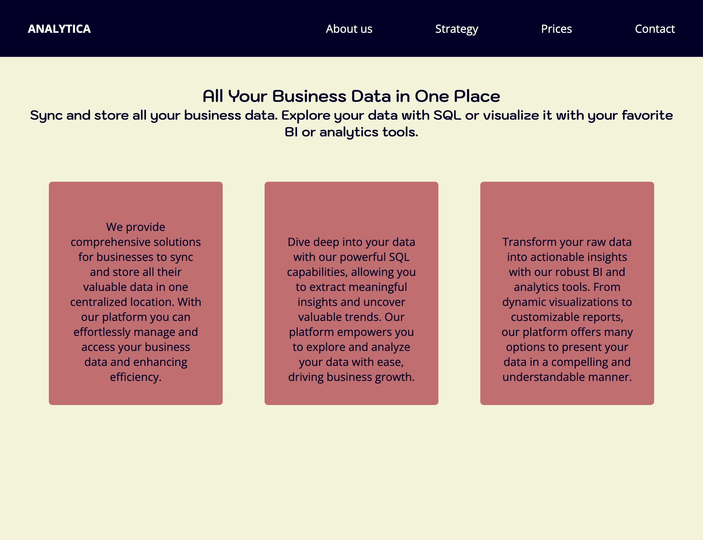

# Flexbox Practice – NOVI Frontend Module Assignment

## About the Project

This repository contains my solutions to a Flexbox assignment for the Frontend Development module at [Novi University](https://www.novi.nl). The goal is to master the use of **CSS Flexbox** for positioning, alignment, and layout-building — progressing from simple alignment tasks to constructing full page layouts and a custom landing page.

---

## Table of Contents

- [Assignment Structure](#assignment-structure)
- [Tech Stack](#tech-stack)
- [Key Features](#key-features)
- [Preview](#preview)
- [Project Setup](#project-setup)
- [Credits](#credits)
- [License](#license)

---

## Assignment Structure

### Part 1: Flexbox Positioning

> Focuses on aligning flex-items inside flex-containers using properties such as `justify-content`, `align-items`, and `align-self`.

### Part 2: Building Layouts with Flexbox

> Introduces more complex layouts using `flex-basis`, `flex-grow`, and `flex-shrink`.

### Part 3: Landing Page Design

> Final challenge: build a simple landing page using your own HTML and Flexbox-based layout.

---

## Tech Stack

- **HTML** – Semantic structure
- **CSS** – Focus on Flexbox (no Grid, no positioning)

---

## Key Flexbox Features Practiced

- `display: flex` and `flex-direction`
- `justify-content` / `align-items` / `align-self`
- `flex-wrap` for responsive row breaking
- `gap` for spacing without margins
- `flex-basis`, `flex-grow`, and `flex-shrink`
- `order` for reordering layout visually
- Nested Flex containers

---

## Preview

<strong>Part 1 – Flexbox Positioning</strong>

<strong>Part 2 – Flexbox Layouts</strong>

<strong>Part 3 – Landing Page</strong>

---

## Project Setup

Clone the repository in an IDE and run `index.html` from part 1, 2 or 3 in your browser.

## Credits
> "Assignment  design, layout structure, and all base materials provided through NOVI University course materials."

## Licence
> "This project is for educational purposes only and is not intended for commercial use."